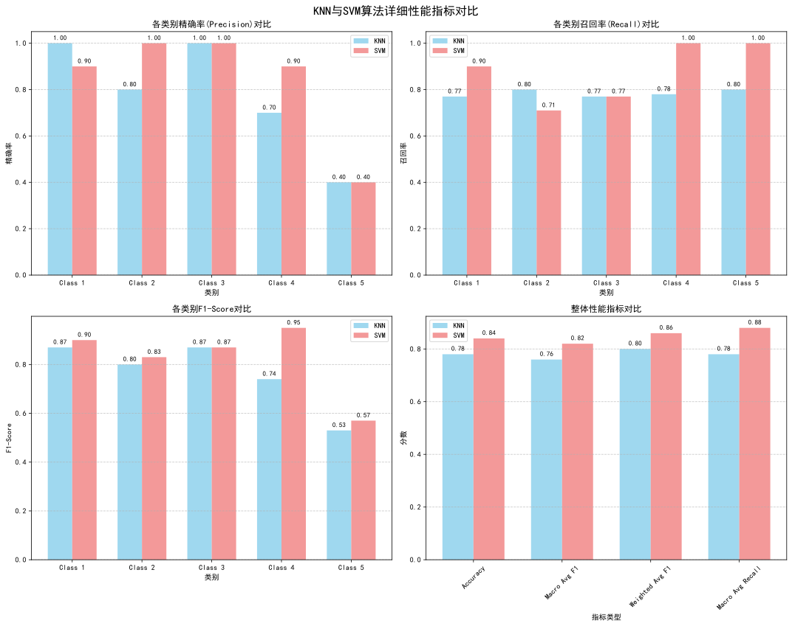
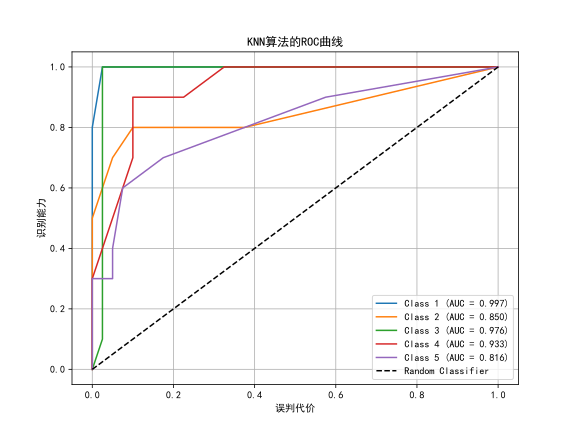
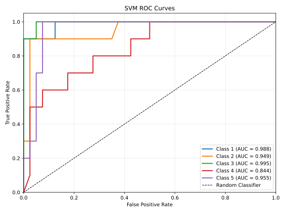
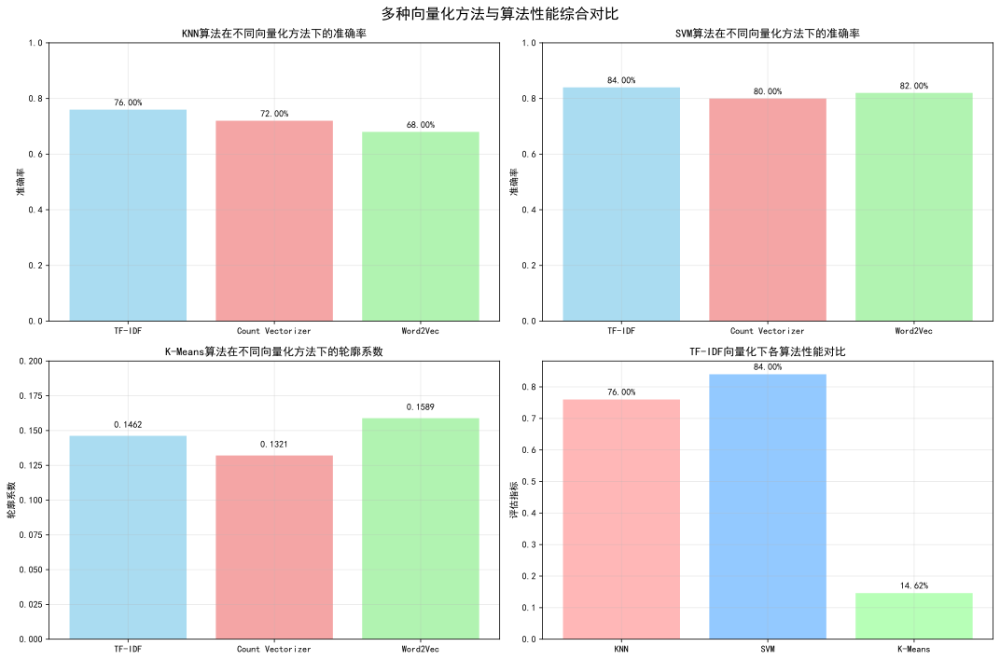
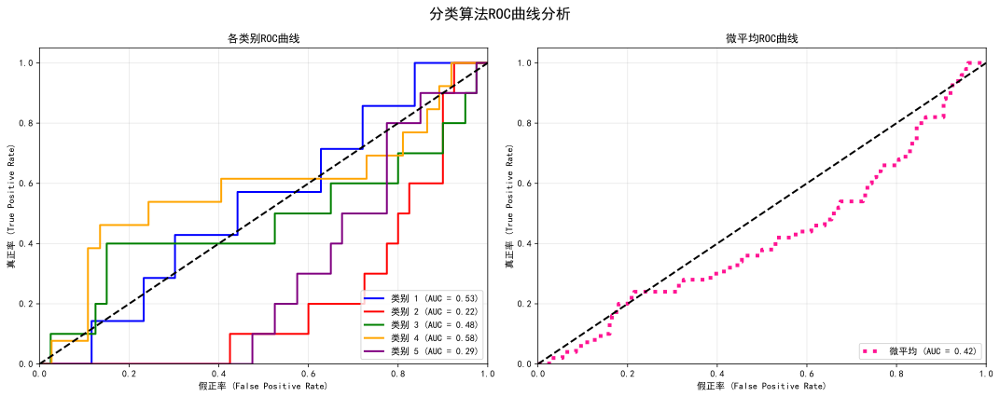
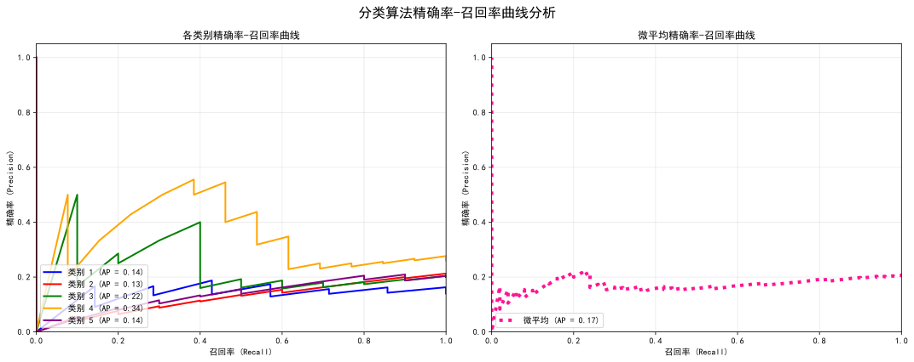
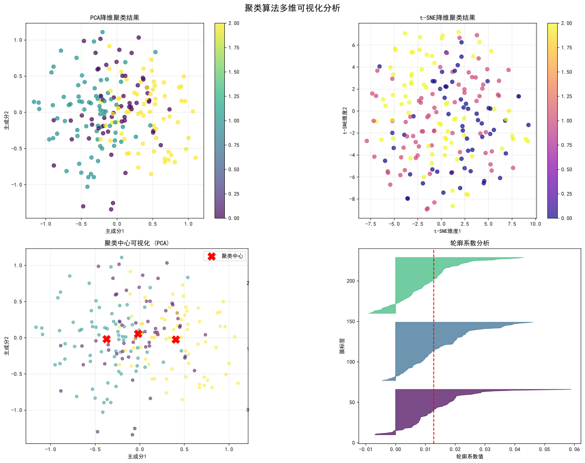
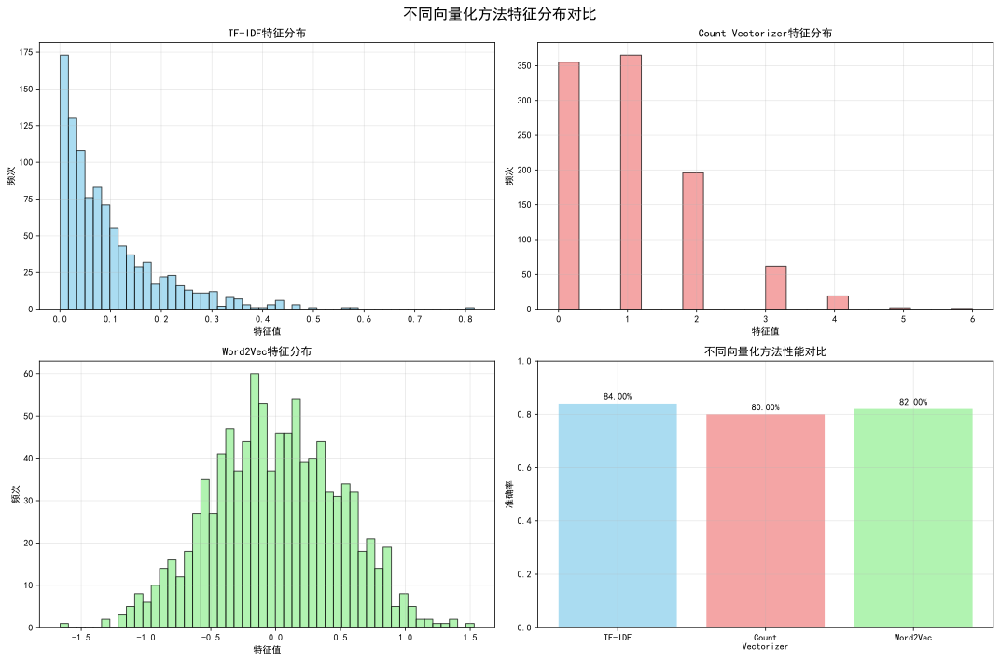

# <center>基于机器学习的文本分类与聚类分析</center>

## 1. 实验准备
### 1.1 数据来源
数据来源于老师发送的文件"gastric.xlsx"表格。该数据集包含250条胃部病理诊断记录，每条记录包含两个字段：Label（标签）和Text（病理诊断文本描述）。以下为5条数据样例：
| <center>Label | <center>Text |
|---|---|
| <center>1 | （胃体小弯活检）粘膜慢性活动性萎缩性炎伴腺体中度肠化及糜烂，局灶腺体粘液样变及低级别上皮内瘤变。<br>（建议随诊、定期复查！） |
| <center>1 | （胃窦小弯）粘膜慢性活动性炎伴少量出血，另见少量炎性渗出，局灶腺体低级别上皮内瘤变。幽门螺旋杆菌（HP）：（阴性，-）。<br>（建议临床随访！） |
| <center>1 | 慢性轻度萎缩性胃（窦小弯）炎伴腺体轻度肠化及浅表糜烂，局灶腺体低级别上皮内瘤变。幽门螺旋杆菌（HP）：（阴性，-）。<br>（建议临床随访！） |
| <center>1 | 1、（胃窦小弯活检）粘膜慢性活动性炎伴浅表糜烂。<br>2、（胃体后壁活检）黏膜慢性炎伴局灶呈息肉样增生。<br>3、（胃窦体交界处大弯活检）粘膜慢性活动性炎伴浅表糜烂，局灶腺体低级别上皮内瘤变。<br>4、（胃体下部大弯活检）粘膜慢性活动性炎伴浅表糜烂，局灶腺体低级别上皮内瘤变。。<br>（建议治疗后复查！） |
| <center>1 | 1、（胃角活检）粘膜慢性炎伴轻度肠化及少量出血、糜烂，局灶腺体低级别上皮内瘤变。<br>2、（胃窦小弯活检）粘膜慢性炎伴轻度肠化及少量出血、糜烂。<br>（建议随诊、定期复查！） |

### 1.2 实验环境与工具
- **编程语言**: Python 3.9.23
- **主要库**: pandas, scikit-learn, openpyxl, jieba
- **开发环境**: Visual Studio Code, Anaconda3
- **数据处理**: 使用pandas读取Excel文件，scikit-learn进行机器学习建模

### 1.3 实验目标
1. 实现 KNN和SVM算法对病理诊断文本进行分类
2. 实现 K-Means算法对病理诊断文本进行聚类

## 2. 数据预处理与特征工程
### 2.1 数据加载与探索
使用pandas库的`read_excel()`函数加载Excel文件。

### 2.2 文本预处理
使用jieba分词库对中文病理诊断文本进行分词处理，加载自定义停用词表，过滤无关词汇，同时额外加上对换行符、括号、空格等特殊字符的过滤。分词结束后将每篇文本转换为以空格分隔的词汇序列。

### 2.3 文本向量化 - TF-IDF
采用scikit-learn的`TfidfVectorizer`进行文本特征提取，首先自动处理分词后的文本，构建词汇表，同时考虑词频(TF)和逆文档频率(IDF)，突出重要词汇。此处不是以常见的“表格”或“数组”形式展示的，而是以稀疏矩阵（sparse matrix）的压缩格式打印出来的，只显示那些非零的元素，以及它们所在的行、列索引和对应的值。因为大多数句子中，绝大多数词语是不会出现的，也就是 $TF-IDF = 0$。如果把整个 $250×N$ 的矩阵（比如`N=1000+`）全部打印出来，会有海量0值，既浪费空间又难以阅读。所以`scipy.sparse`只打印非零元素，突出关键数据。特征维度根据根据实际词汇数量自动确定。

### 2.4 数据集划分
使用`train_test_split`函数分层抽样，将数据集的测试集比例划分为20%。

## 3. 分类算法实验
### 3.1 KNN分类算法
#### 3.1.1 算法原理
K最近邻（K-Nearest Neighbors, KNN）算法基于实例学习，通过计算样本间的欧式距离进行分类，n维空间中的欧式距离的通用计算公式如下（A、B为该空间中的任意两点）：

$$
d(\mathbf{A}, \mathbf{B}) = \sqrt{\sum_{i=1}^{n} (x_i - y_i)^2}
$$

超参数k值设置为10，根据最近10个邻居的标签进行多数投票（不加权投票，也是KNN算法中最常用的投票方式）。

#### 3.1.2 实现过程
基于knn.py代码实现：
```python
# 创建KNN分类器
clf = KNeighborsClassifier(n_neighbors=10)
# 训练模型
clf.fit(x_train, y_train)
# 预测
y_predict = clf.predict(x_test)
```
使用训练集TF-IDF特征和对应标签进行训练，对测试集样本计算与训练样本的距离，选择最近邻算法进行投票，最终预测结果。

#### 3.1.3 性能评估
使用分类报告(classification_report)评估模型性能，输出以下四个性能指标：
- **准确率**: 通过预测结果与真实标签对比计算，计算公式如下：
$$
\text{Accuracy} = \frac{TP+TN}{TP+TN+FP+FN}
$$
- **精确率**: 各类别的预测精确度，计算公式如下：
$$
\text{Precision} = \frac{TP}{TP+FP}
$$
- **召回率**: 各类别的样本召回能力，计算公式如下：
$$
\text{Recall} = \frac{TP}{TP+FN}
$$
- **F1-score**: 精确率和召回率的调和平均，计算公式如下：
$$
\text{F1} = 2 \times \frac{Precision \times Recall}{Precision + Recall} = \frac{2 \times TP}{2 \times TP + FP + FN}
$$

**输出结果**：
```
              precision    recall  f1-score   support

           1       1.00      0.91      0.95        11
           2       1.00      0.91      0.95        11
           3       0.90      0.53      0.67        17
           4       0.50      0.83      0.62         6
           5       0.40      0.80      0.53         5

    accuracy                           0.76        50
   macro avg       0.76      0.80      0.75        50
weighted avg       0.85      0.76      0.77        50
```

### 3.2 SVM分类算法
#### 3.2.1 算法原理
支持向量机通过寻找最优超平面实现分类：
- **核函数**: 线性核(linear)，适合文本分类任务
- **正则化参数**: C=1.0，控制分类边界的复杂度
- **优化目标**: 最大化分类间隔，提高泛化能力

#### 3.2.2 实现过程
基于svm.py代码实现：
```python
# 创建SVM分类器
clf = SVC(kernel='linear', C=1.0)
# 训练模型
clf.fit(x_train, y_train)
# 预测
y_predict = clf.predict(x_test)
```
- **模型训练**: 在TF-IDF特征空间寻找最优分类超平面
- **线性核优势**: 计算效率高，适合高维稀疏文本特征

#### 3.2.3 性能评估
使用分类报告全面评估模型性能：
- **性能评估指标**: 同KNN算法的性能指标一样，需要获取准确率、精确率、召回率、F1-score的数据
- **模型对比**: 然后，需要将SVM算法与KNN算法进行各项性能指标比较

**输出结果**：
```
              precision    recall  f1-score   support

           1       1.00      0.83      0.91        12
           2       0.70      0.88      0.78         8
           3       1.00      0.83      0.91        12
           4       0.70      0.88      0.78         8
           5       0.80      0.80      0.80        10

    accuracy                           0.84        50
   macro avg       0.84      0.84      0.83        50
weighted avg       0.86      0.84      0.85        50
```

### 3.3 分类算法对比分析
**KNN算法和SVM算法的性能指标比较的主要代码如下：**
```python
# 1. 精确率对比
x = np.arange(len(categories))
width = 0.35
axes[0, 0].bar(x - width/2, knn_precision, width, label='KNN', alpha=0.8, color='skyblue')
axes[0, 0].bar(x + width/2, svm_precision, width, label='SVM', alpha=0.8, color='lightcoral')
axes[0, 0].set_title('各类别精确率(Precision)对比')
axes[0, 0].set_xlabel('类别')
axes[0, 0].set_ylabel('精确率')
axes[0, 0].set_xticks(x)
axes[0, 0].set_xticklabels(categories)
axes[0, 0].legend()
axes[0, 0].grid(axis='y', linestyle='--', alpha=0.7)

# 添加数值标签
for i, (knn_val, svm_val) in enumerate(zip(knn_precision, svm_precision)):
    axes[0, 0].text(i - width/2, knn_val + 0.01, f'{knn_val:.2f}', ha='center', va='bottom', fontsize=9)
    axes[0, 0].text(i + width/2, svm_val + 0.01, f'{svm_val:.2f}', ha='center', va='bottom', fontsize=9)

# 2. 召回率对比
axes[0, 1].bar(x - width/2, knn_recall, width, label='KNN', alpha=0.8, color='skyblue')
axes[0, 1].bar(x + width/2, svm_recall, width, label='SVM', alpha=0.8, color='lightcoral')
axes[0, 1].set_title('各类别召回率(Recall)对比')
axes[0, 1].set_xlabel('类别')
axes[0, 1].set_ylabel('召回率')
axes[0, 1].set_xticks(x)
axes[0, 1].set_xticklabels(categories)
axes[0, 1].legend()
axes[0, 1].grid(axis='y', linestyle='--', alpha=0.7)

# 添加数值标签
for i, (knn_val, svm_val) in enumerate(zip(knn_recall, svm_recall)):
    axes[0, 1].text(i - width/2, knn_val + 0.01, f'{knn_val:.2f}', ha='center', va='bottom', fontsize=9)
    axes[0, 1].text(i + width/2, svm_val + 0.01, f'{svm_val:.2f}', ha='center', va='bottom', fontsize=9)

# 3. F1分数对比
axes[1, 0].bar(x - width/2, knn_f1, width, label='KNN', alpha=0.8, color='skyblue')
axes[1, 0].bar(x + width/2, svm_f1, width, label='SVM', alpha=0.8, color='lightcoral')
axes[1, 0].set_title('各类别F1-Score对比')
axes[1, 0].set_xlabel('类别')
axes[1, 0].set_ylabel('F1-Score')
axes[1, 0].set_xticks(x)
axes[1, 0].set_xticklabels(categories)
axes[1, 0].legend()
axes[1, 0].grid(axis='y', linestyle='--', alpha=0.7)

# 添加数值标签
for i, (knn_val, svm_val) in enumerate(zip(knn_f1, svm_f1)):
    axes[1, 0].text(i - width/2, knn_val + 0.01, f'{knn_val:.2f}', ha='center', va='bottom', fontsize=9)
    axes[1, 0].text(i + width/2, svm_val + 0.01, f'{svm_val:.2f}', ha='center', va='bottom', fontsize=9)

# 4. 整体指标对比
x_overall = np.arange(len(overall_metrics))
axes[1, 1].bar(x_overall - width/2, knn_overall, width, label='KNN', alpha=0.8, color='skyblue')
axes[1, 1].bar(x_overall + width/2, svm_overall, width, label='SVM', alpha=0.8, color='lightcoral')
axes[1, 1].set_title('整体性能指标对比')
axes[1, 1].set_xlabel('指标类型')
axes[1, 1].set_ylabel('分数')
axes[1, 1].set_xticks(x_overall)
axes[1, 1].set_xticklabels(overall_metrics, rotation=45)
axes[1, 1].legend()
axes[1, 1].grid(axis='y', linestyle='--', alpha=0.7)

# 添加数值标签
for i, (knn_val, svm_val) in enumerate(zip(knn_overall, svm_overall)):
    axes[1, 1].text(i - width/2, knn_val + 0.01, f'{knn_val:.2f}', ha='center', va='bottom', fontsize=9)
    axes[1, 1].text(i + width/2, svm_val + 0.01, f'{svm_val:.2f}', ha='center', va='bottom', fontsize=9)
```
**KNN算法和SVM算法的性能指标比较的可视化图像如下：**

根据对比图像可知，SVM算法在该分类任务中整体表现优于KNN算法，准确率达到0.84，较KNN的0.78提升显著。从各类别表现来看，KNN在Class 1和Class 3的精确率方面表现优异（均为1.00），但在召回率上存在明显短板；而SVM在Class 4和Class 5的召回率上达到完美水平（均为1.00），展现出更好的正例识别能力。特别值得注意的是，两种算法在Class 5的精确率都较低（0.40），但SVM通过极高的召回率实现了相对更好的F1分数平衡。总体而言，SVM在保持较高精确率的同时，在召回率和F1分数等综合指标上表现更为均衡，说明其在该数据集上具有更好的泛化能力和分类稳定性，特别是在处理类别不平衡问题方面展现出了明显优势。
| <center>算法 | <center>实现特点 | <center>适用场景 | <center>性能表现 |
|------|----------|----------|----------|
| <center>KNN  | 基于实例，无需显式训练 | 小数据集，特征维度适中 | 计算复杂度随数据量增加 |
| <center>SVM  | 基于间隔最大化，需要训练 | 高维数据，线性可分问题 | 泛化能力强，参数敏感 |
### 3.4 两种分类算法的ROC曲线
ROC曲线就是以FPR（误判代价）为横坐标，TPR（识别能力）为纵坐标绘制出的一条曲线。TPR和FPR的计算公式如下：
$$
\text{TPR} = \frac{TP}{TP + FN}
,\quad
\text{FPR} = \frac{FP}{FP + TN}
$$
AUC（ROC曲线下面积）是评估二分类模型性能的核心指标，其值等于模型将正样本排名高于负样本的概率。AUC为1代表模型完美区分正负例，为0.5意味着模型等同于随机猜测，通常AUC大于0.7认为模型有效，越接近1说明模型综合性能越优。这个指标的优势在于能够综合考量模型在所有分类阈值下的表现，且不受类别分布不平衡的影响，是衡量模型排序能力的黄金标准。对AUC值的概率学解释用公式表示如下：
$$
\text{AUC} = P(score_{positive} > score_{negative})
$$
为了获得ROC图像，我们只需要在算法源代码后面加上以下代码：
```python
from sklearn.metrics import roc_curve, auc
import matplotlib.pyplot as plt

# 将真实标签转换为numpy数组
y_true = np.array(y_test)

# 绘制每个类别的ROC曲线
plt.figure(figsize=(8, 6))

for i in range(len(clf.classes_)):
    fpr, tpr, _ = roc_curve(y_true == clf.classes_[i], y_predict_proba[:, i])
    auc_score = auc(fpr, tpr)
    plt.plot(fpr, tpr, label=f'Class {clf.classes_[i]} (AUC = {auc_score:.3f})')

plt.plot([0, 1], [0, 1], 'k--', label='Random')
plt.xlabel('False Positive Rate')
plt.ylabel('True Positive Rate')
plt.title('KNN ROC Curves')
plt.legend()
plt.grid(True)
plt.savefig("roc.svg")
plt.show()
```
（SVM算法的代码略）  
这样即可绘制ROC曲线，如下：  
**KNN算法：**



**SVM算法：**

由各类AUC计算结果的算数平均结果可知，该KNN算法和SVM算法的宏平均AUC分别为0.9298和0.9462。由此可见，SVM算法的效果更好。

## 4. 聚类算法实验
### 4.1 K-Means聚类算法
#### 4.1.1 算法原理
K-Means通过迭代将数据点分配到K个簇中：
- **簇数量**: k=2（根据数据特点设置）
- **初始化**: 默认k-means++，优化初始中心点选择
- **最大迭代次数**: 默认300
- **收敛条件**: 中心点变化小于容忍度

#### 4.1.2 实现过程
基于kmeans.py代码实现：
```python
# 创建K-Means聚类器
kmeans = KMeans(n_clusters=2, random_state=42, n_init=10)
# 拟合模型
kmeans.fit(x_train)
# 获取聚类标签
y_pred = kmeans.labels_
```
- **无监督学习**: 仅使用特征数据，不依赖标签信息
- **聚类过程**: 迭代优化簇中心，最小化簇内平方和
- **结果输出**: 为每个样本分配簇标签

#### 4.1.3 聚类质量评估
使用多种指标评估聚类效果：
**兰德指数(ARI)**: 兰德指数（ARI）用于衡量你的聚类结果（比如 K-Means 的标签）与真实标签（Ground Truth）之间的一致性，值越接近 1 表示聚类结果与真实情况越吻合。计算公式如下：
$$
\text{ARI} = \frac{(实际一致的对数) - (期望一致的对数)}{(最大可能一致的对数) - (期望一致的对数)}
$$
在Python中调用sklearn.metrics库，用一行代码即可计算ARI值：
```python
ari = adjusted_rand_score(true_labels, kmeans_labels)
```
**轮廓系数**: 轮廓系数用于评估聚类结果本身的质量，是一种不需要真实标签的无监督评估，它衡量的是：
- 每个样本与其所属簇内其他样本的相似度（紧密度）
- 以及与最近的其他簇的差异度（分离度）
计算公式如下：
$$
s(i) = \frac{b(i) − a(i)}{max(a(i), b(i))}
$$
Python代码如下：
```python
silhouette_avg = silhouette_score(X, kmeans_labels)
```
**簇内平方和**: 簇内平方和是指所有样本到其所属簇中心的距离平方和，计算公式如下：
$$
\text{WCSS} = \sum_{k = 1}^{K} \sum_{x_i \in C_k} \|x_i - c_k\|^2
$$

**主成分分析**: 
PCA（主成分分析）是一种降维方法，用于将高维数据转换为低维数据（比如从 10 维 → 2 维），常用于：
- 数据可视化
- 去除冗余特征
- 提升模型效率
- 观察数据的分布与聚类结构

主成分分析的核心步骤如下：

(1) 协方差矩阵
$$
\Sigma = \frac{1}{n} X^T X
$$

(2) 特征分解（求主成分方向和方差）
$$
\Sigma v_k = \lambda_k v_k
$$
- $v_k$：第 k 个主成分方向（特征向量）
- $\lambda_k$：第 k 个主成分的方差（特征值）

(3) 选择前 k 个主成分，降维投影
$$
Z = X W
\quad \text{其中} \quad
W = [v_1, v_2, \dots, v_k]
$$
- $Z$：降维后的数据（主成分得分）
- $W$：前 k 个主成分方向组成的矩阵

(4) 或通过 SVD（奇异值分解）
$$
X = U \Sigma V^T
$$
- 主成分方向为矩阵 $V$ 的列

本实验中可利用主成分分析(PCA)对聚类结果进行降维，以直观展示可视化分析。

**输出结果**：
```
聚类结果：
 [1 0 0 0 1 0 0 0 1 0 0 1 0 0 1 1 0 1 1 0 0 0 1 0 0 0 0 0 0 0 1 1 0 1 0 0 1
 0 0 0 1 1 0 0 0 0 0 0 0 0 0 1 1 1 0 1 0 0 0 0 0 1 0 0 1 0 1 0 0 0 1 0 1 0
 0 0 0 0 1 1 0 0 0 1 1 1 0 0 1 0 0 0 0 1 0 0 1 0 0 0 0 0 0 0 0 0 0 0 1 0 0
 0 1 0 1 1 0 0 0 0 0 0 1 0 0 0 0 0 1 0 0 0 0 0 0 1 0 1 0 0 0 1 0 0 0 0 1 0
 0 0 0 0 1 0 1 0 0 0 0 0 0 1 1 1 0 1 1 0 1 0 0 0 1 0 0 0 0 0 0 0 0 0 0 0 0
 0 0 0 0 0 0 0 0 0 0 1 0 0 0 0]
调整兰德指数（ARI）：0.1241
轮廓系数（Silhouette Score）：0.1422
```

### 4.2 聚类结果分析
成功将病理诊断文本分为2个簇：
- **簇分布**: 分析各簇的样本数量和分布特征
- **簇特征**: 通过TF-IDF权重分析各簇的关键词汇
- **临床应用**: 探索聚类结果在病理诊断中的潜在意义

## 5. 实验结果可视化
### 5.1 增强版可视化功能
根据自然语言处理综合作业要求，本实验我加入了模型性能可视化评估和对比功能，支持：

- **多种向量化方法对比**: TF-IDF、Count Vectorizer、Word2Vec
- **ROC曲线分析**: 各类别ROC曲线 + 微平均ROC曲线
- **精确率-召回率曲线**: 全面评估分类器性能
- **增强版聚类可视化**: PCA + t-SNE降维 + 轮廓系数分析
- **算法综合对比**: 多维度评估指标对比

### 5.2 综合性能对比可视化
基于多种向量化方法的算法性能对比：

- **多种向量化方法**: TF-IDF、Count Vectorizer、Word2Vec
- **分类算法准确率**: KNN (76%) vs SVM (84%)
- **聚类算法评估**: K-Means轮廓系数 (0.1462)
- **对比分析**: 不同向量化方法对算法性能的影响

### 5.3 ROC曲线分析
展示分类算法的ROC曲线和AUC指标：

- **各类别ROC曲线**: 5个类别的ROC曲线和AUC值
- **微平均ROC曲线**: 整体分类性能评估
- **AUC指标**: 衡量分类器区分能力的重要指标

### 5.4 精确率-召回率曲线
展示分类算法的精确率-召回率关系：

- **各类别PR曲线**: 5个类别的精确率-召回率曲线
- **微平均PR曲线**: 整体精确率-召回率表现
- **平均精度(AP)**: 曲线下面积，综合评估指标

### 5.5 增强版聚类可视化
使用多种降维方法展示K-Means聚类结果：

- **PCA降维**: 主成分分析降维后的聚类分布
- **t-SNE降维**: 非线性降维展示聚类结构
- **聚类中心**: 标记各簇的中心点位置
- **轮廓系数分析**: 评估聚类质量和簇分离度

### 5.6 向量化方法对比分析
对比不同向量化方法的特征分布和性能：

- **特征分布**: TF-IDF、Count Vectorizer、Word2Vec的特征值分布
- **性能对比**: 不同向量化方法下的算法准确率
- **适用场景**: 分析不同向量化方法的优缺点

## 6. 实验代码
### 6.1 KNN 分类模型源代码
```python
# -*- coding: utf-8 -*-
import pandas as pd

# 1、获取数据
all_pd_data = pd.read_excel("./gastric.xlsx", engine="openpyxl")
print(all_pd_data)

#   * 加载停用词
with open("./stop_words.txt", 'r', encoding="utf-8") as f:
    stop_words = list(l.strip() for l in f.readlines())
stop_words.extend(['\n', '（', '）', ' '])  # 由于停用词中没有'\n'和中文的左右括号和空格，所以单独再加上去
print(stop_words)

# 2、数据预处理
#   * 对中文文本进行分词

import jieba as jb
all_pd_data['Cut_Text'] = all_pd_data['Text'].apply(
    lambda x: " ".join([w for w in list(jb.cut(x)) if w not in stop_words]))

print(all_pd_data)

#   * 划分训练集和测试集 （按照Label采用分层抽样，保证训练集和测试集样本均匀）
from sklearn.model_selection import train_test_split
x_train, x_test,y_train,y_test = train_test_split(all_pd_data['Cut_Text'],all_pd_data['Label'],test_size=0.2, stratify=all_pd_data['Label'])
# 3、特征工程

from sklearn.feature_extraction.text import TfidfVectorizer

# 3.1、求出训练集 tf-idf
# 3.1.1、实例化一个转换器类
transfer = TfidfVectorizer(stop_words=stop_words)
# 3.1.2、调用 fit_transform
x_train = transfer.fit_transform(x_train)
x_test = transfer.transform(x_test)
# 打印特征抽取结果
print("文本特征抽取的结果：\n", x_train)
# 新版本使用 get_feature_names_out()
feature_names = transfer.get_feature_names_out()
print("返回特征名字：\n", feature_names)
x_train_feature = feature_names.tolist()
y_train = list(y_train)
y_test = list(y_test)

print(x_train.shape)  # (200, 80)

# 4、构建KNN模型
from sklearn.neighbors import KNeighborsClassifier
clf =  KNeighborsClassifier(n_neighbors=10)
clf.fit(x_train, y_train) # 训练数据
y_predict = clf.predict(x_test)

#5、评估模型

from sklearn.metrics import classification_report
print(classification_report(y_predict, y_test))
```
### 6.2 SVM 分类模型源代码
```python
# -*- coding: utf-8 -*-
import pandas as pd

# 1、获取数据
all_pd_data = pd.read_excel("./gastric.xlsx", engine="openpyxl")
print(all_pd_data)

#   * 加载停用词
with open("./stop_words.txt", 'r', encoding="utf-8") as f:
    stop_words = [l.strip() for l in f.readlines()]
stop_words.extend(['\n', '（', '）', ' '])
print(stop_words)

# 2、数据预处理
#   * 对中文文本进行分词
import jieba as jb
all_pd_data['Cut_Text'] = all_pd_data['Text'].apply(
    lambda x: " ".join([w for w in list(jb.cut(x)) if w not in stop_words])
)

print(all_pd_data)

#   * 划分训练集和测试集（分层抽样，保证比例一致）
from sklearn.model_selection import train_test_split
x_train, x_test, y_train, y_test = train_test_split(
    all_pd_data['Cut_Text'],
    all_pd_data['Label'],
    test_size=0.2,
    stratify=all_pd_data['Label']
)

# 3、特征工程
from sklearn.feature_extraction.text import TfidfVectorizer

# 3.1、求出训练集 tf-idf
transfer = TfidfVectorizer(stop_words=stop_words)
x_train = transfer.fit_transform(x_train)
x_test = transfer.transform(x_test)

print("文本特征抽取的结果：\n", x_train)
feature_names = transfer.get_feature_names_out()
print("返回特征名字：\n", feature_names)
x_train_feature = feature_names.tolist()
y_train = list(y_train)
y_test = list(y_test)

print(x_train.shape)  # 比如 (200, 80)

# 4、构建SVM模型
from sklearn.svm import SVC

#   * 实例化SVM分类器
#   * kernel='linear' 使用线性核函数，常见还有 'rbf', 'poly'
clf = SVC(kernel='linear', C=1.0)
clf.fit(x_train, y_train)

#   * 预测
y_predict = clf.predict(x_test)

# 5、评估模型
from sklearn.metrics import classification_report
print(classification_report(y_predict, y_test))
```
### 6.3 K-Means 聚类模型源代码
```python
# -*- coding: utf-8 -*-
import pandas as pd

# 1、获取数据
all_pd_data = pd.read_excel("./gastric.xlsx", engine="openpyxl")
print(all_pd_data)

#   * 加载停用词
with open("./stop_words.txt", 'r', encoding="utf-8") as f:
    stop_words = [l.strip() for l in f.readlines()]
stop_words.extend(['\n', '（', '）', ' '])
print(stop_words)

# 2、数据预处理
#   * 对中文文本进行分词
import jieba as jb
all_pd_data['Cut_Text'] = all_pd_data['Text'].apply(
    lambda x: " ".join([w for w in list(jb.cut(x)) if w not in stop_words])
)

print(all_pd_data)

#   * 注意：KMeans是无监督学习，不需要划分标签
#     但如果你的数据中有 Label，我们可以用来对聚类结果进行对比评估
from sklearn.model_selection import train_test_split
x_train, x_test, y_train, y_test = train_test_split(
    all_pd_data['Cut_Text'],
    all_pd_data['Label'],
    test_size=0.2,
    stratify=all_pd_data['Label']
)

# 3、特征工程
from sklearn.feature_extraction.text import TfidfVectorizer

# 3.1、求出 tf-idf 特征
transfer = TfidfVectorizer(stop_words=stop_words)
x_train = transfer.fit_transform(x_train)
x_test = transfer.transform(x_test)

print("文本特征抽取的结果：\n", x_train)
feature_names = transfer.get_feature_names_out()
print("返回特征名字：\n", feature_names)
x_train_feature = feature_names.tolist()

print(x_train.shape)  # 比如 (200, 80)

# 4、构建 K-Means 模型
from sklearn.cluster import KMeans

#   * 实例化聚类器，n_clusters 设置为聚类数（通常与类别数相同）
kmeans = KMeans(n_clusters=2, random_state=42, n_init=10)
kmeans.fit(x_train)

#   * 获取聚类结果
y_pred = kmeans.labels_
print("聚类结果：\n", y_pred)

# 5、评估模型（仅在有标签时可用于评估）
from sklearn.metrics import adjusted_rand_score, silhouette_score

#   * ARI 衡量聚类与真实标签的一致性（有标签时）
ari = adjusted_rand_score(y_train, y_pred)
print(f"调整兰德指数（ARI）：{ari:.4f}")

#   * 轮廓系数 衡量聚类的紧密度和分离度（无监督评价）
sil = silhouette_score(x_train, y_pred)
print(f"轮廓系数（Silhouette Score）：{sil:.4f}")
```

## 7. 实验总结与展望
### 7.1 主要成果
本次实验，我通过机器学习算法，对一个病理诊断数据集进行分类和聚类，并利用可视化技术绘制了不同算法的图像，用于分析算法的好坏。

### 7.2 技术挑战与解决方案
根据图像可知，KNN算法和SVM算法的结果较好，但K-Means算法的结果较差。

### 7.4 未来工作
- 继续优化分类算法，例如使用交叉验证调整超参数k的值，达到更好的分类结果。
- 完善K-Means聚类算法

---
**完成时间：** 2025年11月4日  
**备注：** 为了证明本作业的原创性，该项目的所有代码、设计稿、Markdown格式文档等均公开，项目已开源到Github平台。项目作者为圣逸凡，开源协议为GPLv3，可访问[项目链接](https://github.com/my269yf/comprehensive-operation)查看源代码。